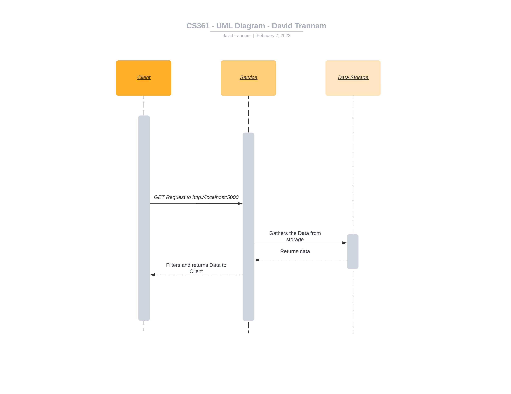

# CS361 W22 Project David Trannam

CS361 W22 Project by David Trannam. A react application that allows users to search/filter data from the Bureau of Labor Statistics. Data is pulled directly from the May 2021 National Occupational Employment and Wage Estimates Report (https://www.bls.gov/oes/current/oes_nat.htm)

## Getting Started 

1. Download/Install Node.js (https://nodejs.org/en/download/)
2. Clone the Repo
3. Download the dependencies by running the below command at the root of the project

      > npm install 
      
      
### Running the Web App

Run the following command and navigate to http://localhost:3000/

    > npm start
    
    
### Running the Web Service

Run the following command and send get requests to http://localhost:5000/

    > node service.js
    
## Web Service Details

Follow the steps found in "Running the Web Service" section to start the service. The service can be ran independently of the web app step.

### How to REQUEST data 

Ensure that the web service is running. Request to the data is done via standard HTTP calls. This app has only one endpoint (**http://localhost:5000/**) which accepts only a **GET** request. Optional query parameters can be found below:

| Parameter Name      | Example Value | Notes|
| ----------- | ----------- | ----------- 
| *null*      | *null*       | Returns all the data |
| title      | Software       | Returns JSON data where the title matches the example value. This is not case sensitive |
| salary   | 50000        |Returns JSON data where the annual salary is +/- 5000 from the salary information  |

### How to RECEIVE data

Data is sent back in a standard JSON format and will indicate code of 200 regardless if a match is found or not after a GET request is sent. Below is an example:

``` javascript
  [
    {
        "Code": 151252,
        "Title": "Software Developers",
        "Employment": "1,364,180",
        "EmploymentPer1000": 9.68,
        "Median": "58",
        "Mean": "58.17",
        "Annual": "120,990"
    },
    {
        "Code": 151254,
        "Title": "Web Developers",
        "Employment": "84,820",
        "EmploymentPer1000": 0.6,
        "Median": "37",
        "Mean": "39.09",
        "Annual": "81,320"
    }
    ]
```
*GET Request to http://localhost:5000/?title=developer*

### UML sequence diagram


